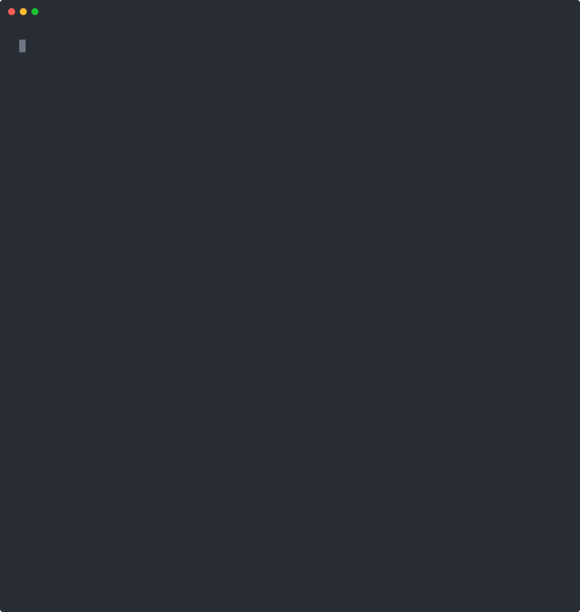
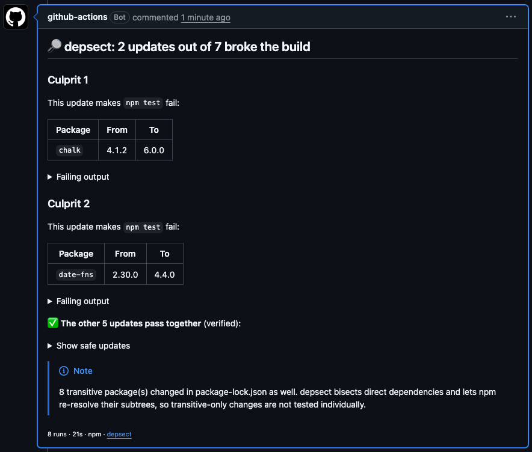

# depsect

[](https://www.npmjs.com/package/depsect) [](https://github.com/LilVi02/depsect/actions/workflows/ci.yml) [](LICENSE)

**`git bisect` for grouped dependency updates.**
Dependabot bumped 23 packages in one PR and CI is red. Which one broke it? `depsect` tells you, and hands you the other 22 already verified green.

Works with **npm, pnpm, Yarn, uv, Poetry, Cargo, Go modules, Composer, Bundler, Maven and Gradle**.

<p align="center">
  
</p>

<p align="center"><sub>A real run on <a href="https://github.com/LilVi02/depsect-demo">depsect-demo</a>: 7 real npm packages bumped in one PR. Install and test time is compressed.</sub></p>

## Why

Grouping dependency updates is great until the group fails. Then you get one red check and 20 bumps, and the options are all bad: merge nothing, bump packages by hand one at a time, or split the group and wait for more CI runs. Lockfile refreshes (Renovate's *lock file maintenance*, `cargo update`, `uv lock --upgrade`) are worse still: hundreds of transitive packages move and nothing in the manifest changes.

`git bisect` doesn't help, because every update lives in **the same commit**. depsect bisects *inside* the change: it applies subsets of the updates on top of the old lockfile, runs your tests, and narrows down to the smallest set that fails.

It finds:

- **the single bad bump** in `O(log n)` runs: 64 updates take about 10 runs, not 64;
- **incompatible pairs** (or triples): `react@19` is fine and `some-lib@5` is fine, but together they break;
- **several independent culprits** in the same PR;
- **the transitive package** that broke a lockfile refresh;
- the **safe set**: every other update, re-verified together. The Action can open a PR with just those.

If the build fails even without the updates, or passes with all of them, depsect says so instead of blaming an innocent package.

## GitHub Action

Run it when a bot's dependency PR fails:

```yaml
# .github/workflows/depsect.yml
name: depsect
on: pull_request

jobs:
  depsect:
    if: github.actor == 'dependabot[bot]' || github.actor == 'renovate[bot]'
    runs-on: ubuntu-latest
    permissions:
      contents: write # only needed for open-pr
      pull-requests: write # to post the report
    steps:
      - uses: actions/checkout@v5
        with:
          fetch-depth: 0
      - uses: actions/setup-node@v5 # or setup-python / setup-uv / setup-go / rust-toolchain
        with:
          node-version: 22
      - uses: LilVi02/depsect@v0
        with:
          test-command: npm test
          open-pr: true # open a PR with just the safe updates
```

Set up the toolchain the same way your normal CI does (`pnpm/action-setup`, `corepack enable`, `astral-sh/setup-uv`, `pipx install poetry`, `actions/setup-go`, `dtolnay/rust-toolchain`).

It posts a report on the PR (and updates it on re-runs) with the culprit, the failing output, and the list of safe updates. The same report goes to the job summary.

<p align="center">
  <a href="https://github.com/LilVi02/depsect-demo/pull/1"></a>
</p>

With `open-pr: true`, depsect also pushes a `depsect/safe-updates-<pr>` branch from the PR's head with only the safe updates applied, opens a pull request for it, and links it in the report. The branch is refreshed on every run. Repositories don't let `GITHUB_TOKEN` open pull requests by default: enable *Allow GitHub Actions to create and approve pull requests* (Settings → Actions → General) or pass a `pr-token`. Otherwise depsect still pushes the branch and links a prefilled "open a pull request" page.

| Input | Default | |
| --- | --- | --- |
| `test-command` | *required* | Command that must pass. |
| `install-command` | auto | How to install dependencies. Defaults to the package manager's own (see below). |
| `base` | PR base commit | Ref with the old dependencies. |
| `head` | `HEAD` | Ref with the new dependencies. |
| `working-directory` | `.` | Where to run. Projects changed below it are found automatically (see [Monorepos](#monorepos)). |
| `transitive` | `auto` | Bisect transitive (lockfile-only) changes: `auto` does it when no direct dependency changed (e.g. lock file maintenance); `always`; `never`. |
| `open-pr` | `false` | Open a PR with just the safe updates. Needs `contents: write`. |
| `pr-token` | `github-token` | Token for the safe-updates PR. Pushes made with the default `GITHUB_TOKEN` don't trigger other workflows, so pass a PAT or GitHub App token if CI should run on that PR. |
| `retries` | `0` | Re-run failing tests before trusting them (flaky suites). |
| `timeout-minutes` | `0` | Per-command timeout. |
| `apply-safe` | `false` | Write the safe updates to the working tree. |
| `comment` | `true` | Comment on the PR. |
| `fail-on-culprit` | `true` | Fail the step when a culprit is found. |

Outputs: `status` (`found` / `no-failure` / `base-broken` / `no-updates`), `culprits` (JSON, e.g. `[["alpha"],["delta","gamma"]]`), `safe` (JSON), `safe-pr` (URL).

## CLI

```bash
npx depsect --test "npm test"                        # compares HEAD~1 → HEAD
npx depsect --base origin/main --test "cargo test"
npx depsect --test "uv run pytest" --transitive always
npx depsect --test "go test ./..." --apply-safe      # keep only the safe bumps
npx depsect --test "./gradlew test"                  # Maven/Gradle: versions in pom.xml, catalogs, build scripts
```

depsect works in a throwaway `git worktree`, so your checkout stays untouched (unless you pass `--apply-safe`). Run `depsect --help` for all options. Exit codes: `0` no culprit, `1` culprit found, `2` base already broken, `3` error.

## Supported ecosystems

The package manager is picked from the lockfile. Each one applies a subset of updates the most faithful way it allows:

| | Detected by | Applying a subset | Transitive changes | Default install |
| --- | --- | --- | --- | --- |
| **npm** | `package-lock.json` | head's declaration, pinned to the exact version head resolved | spliced from the head lockfile | `npm install` |
| **pnpm** | `pnpm-lock.yaml` | same | `pnpm.overrides` | `pnpm install --no-frozen-lockfile` |
| **Yarn** v1 and Berry | `yarn.lock` | same | `resolutions` | `yarn install` |
| **uv** | `uv.lock` | the lockfile is composed package by package from base and head | same | `uv sync --frozen` |
| **Poetry** | `poetry.lock` | same | same | `poetry sync` |
| **Cargo** | `Cargo.lock` | `cargo update -p name@old --precise new`, plus head's declaration in `Cargo.toml` | same | `cargo fetch` |
| **Go** | `go.mod` | `go get module@version` on top of the base `go.mod` | `// indirect` requirements, same way | `go mod download` |
| **Composer** | `composer.lock` | the lockfile is composed package by package; `composer.json` gets base constraints back for the rest, and the `content-hash` is recomputed | same | `composer install` |
| **Bundler** | `Gemfile.lock` | head's lockfile with every other gem put back to base: all its platform builds, `DEPENDENCIES`, `CHECKSUMS`, and its `gem` line in the Gemfile | same | `bundle install` |
| **Maven** | `pom.xml` | head's poms with every other version put back to base, inline (`<version>`) or in `<properties>`; modules included | no lockfile | none (the build resolves) |
| **Gradle** | `build.gradle(.kts)`, `settings.gradle(.kts)` | same for version catalogs (`gradle/*.versions.toml`), `"group:artifact:version"` strings and plugin versions; subprojects included | no lockfile | none (the build resolves) |

Python environments, PHP projects and Ruby bundles hold one version of each package, so for uv, Poetry, Composer and Bundler the dependency state is exactly "base, with these packages from head" (plus any new packages they need), installed as-is. Maven and Gradle have no lockfile, so depsect bisects the versions the build files declare; the build resolves the rest.

## Monorepos

depsect finds every project a PR touches on its own. For each changed manifest or lockfile it walks up to the nearest directory with a lockfile, so:

- **workspaces** are one project: npm, pnpm and Yarn workspaces, Cargo workspaces and uv workspaces are read as a whole, and a direct update is applied in whichever member manifests declare it;
- **independent projects** changed by the same PR (say `web/` with npm and `api/` with Go) are bisected together, each update applied in its own project. The report adds a Project column.

The test command runs from the working directory, so give it one that covers everything, e.g. `npm test --prefix web && (cd api && go test ./...)`. Projects whose part of a subset did not change are not reinstalled between runs.

## How it works

1. Read the manifest and lockfile at `base` and `head` and list every package whose resolved version changed, direct or transitive.
2. Check out `head` in a temporary worktree, so the code stays constant and only dependencies vary.
3. For a subset *S* of updates, start from the **base** dependency state, apply just *S* (see the table above), install, and run the tests. Everything outside *S* stays at its base version.
4. Search:
   - check that the empty set passes and the full set fails;
   - binary-search the shortest failing prefix, whose last update is required;
   - if that update fails alone, it is the culprit; otherwise, keep it fixed and search the prefix again for its partner. This finds minimal interacting sets without testing every combination;
   - remove the culprit set and repeat until the rest passes. What is left is the safe set.
5. Every subset result is cached, so no configuration runs twice.

## Status and roadmap

- [x] npm, pnpm, Yarn v1, Yarn Berry
- [x] Python (uv, Poetry), Cargo, Go modules
- [x] Bisect transitive-only lockfile changes
- [x] Open a PR with the safe updates from the Action
- [ ] Run independent subsets in parallel
- [x] Workspaces and monorepos with several lockfiles in one PR
- [x] Bundler, Composer, Maven/Gradle

Known limitations:

- For npm, pnpm and Yarn, applying a direct update lets the package manager re-resolve that package's own subtree, which can differ slightly from the bot's lockfile. This almost never changes the verdict.
- pnpm and Yarn cannot force a transitive package that is installed at several versions side by side; such changes are listed in the report as not isolated.
- `install-command`, when set, is used for every project in the run.
- Maven and Gradle: an imported BOM is one update, so the artifacts it manages move together with it. Version ranges and versions computed in build logic are not bisected, and Gradle dependency locking (`gradle.lockfile`) is not read yet.

## Development

```bash
npm install
npm test        # unit tests + offline end-to-end tests against real package managers
npm run build   # compiles to dist/ (committed, used by the Action)
```

The end-to-end tests build throwaway repos with a local npm registry, a local PyPI index, a Cargo directory source, a file-based Go proxy, a Composer artifact repository, a RubyGems compact index and a file-based Maven repository. Everything runs offline except Maven's and Gradle's build plugins and JUnit, which come from Maven Central. Each ecosystem's tests run when its tools are on `PATH` (Yarn Berry also needs `DEPSECT_TEST_BERRY_PATH`); `DEPSECT_E2E=npm,cargo` runs a subset.

## License

[Apache License 2.0](LICENSE)
